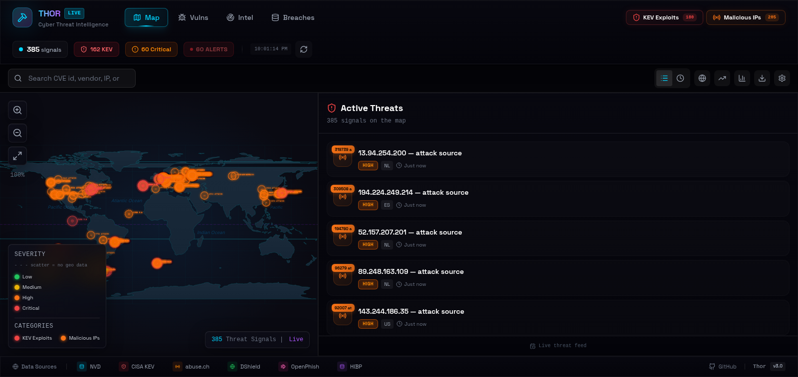
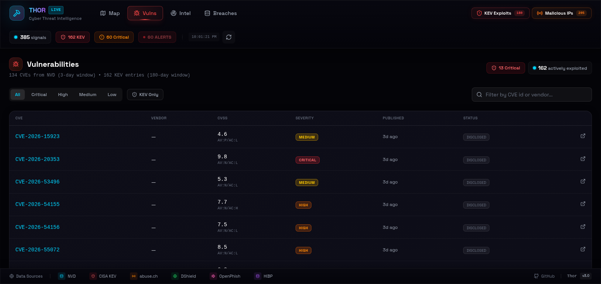
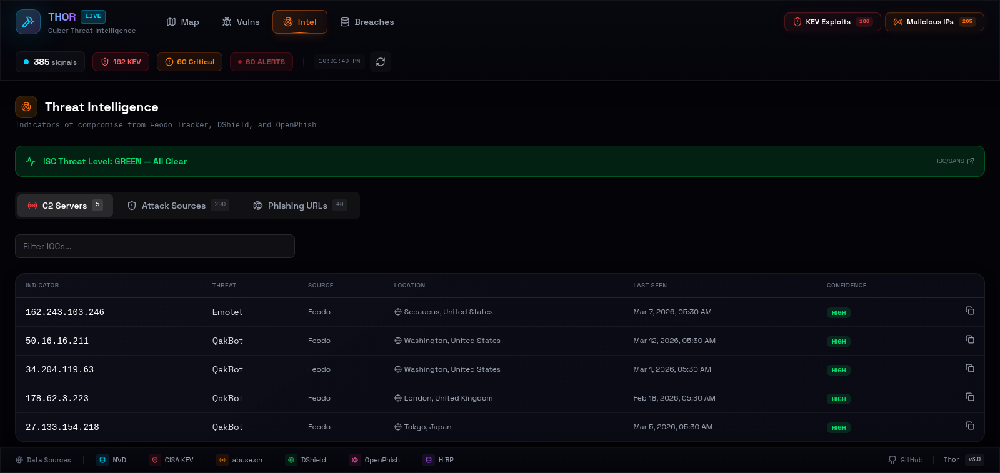
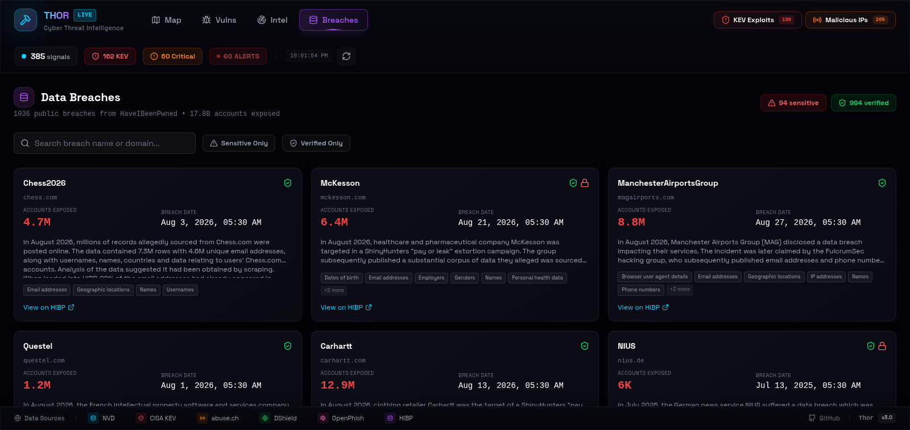

<div align="center">

# ⚡ Thor

**A live, key-free cyber threat intelligence dashboard.**

Real-time map of actively exploited vulnerabilities, botnet C2 servers, attack
sources, phishing infrastructure, and data breaches — wrapped in a cyberpunk
SOC-style interface. No API keys. No accounts. No telemetry.

[](https://github.com/Dev-Lahrani/Thor/actions/workflows/ci.yml)
[](LICENSE)
[](CONTRIBUTING.md)
[](#-development)
[](https://react.dev)
[](https://www.typescriptlang.org)



</div>

---

## Why Thor?

Most threat-intel tooling is either enterprise-priced, buried behind API keys,
or ugly terminal output. Thor aggregates the **best free intelligence feeds**
into a single live dashboard you can run in 30 seconds:

- 🔓 **Zero configuration** — clone, install, run. Nothing to sign up for.
- 🌍 **Geospatial** — see where threats originate, not just lists of IPs.
- 🎯 **Exploit-focused** — CISA KEV data means you see what's *actually being
  exploited*, not just what's newly disclosed.
- 📤 **Actionable** — export IOCs as CSV/JSON or a firewall-ready blocklist.
- 🔒 **Private by design** — client-side only; no backend, no keys, no tracking.

## 🖼️ Screenshots

| Vulnerabilities | Threat Intel |
|---|---|
|  |  |

| Data Breaches | 3D Globe & Trends |
|---|---|
|  | *3D globe view with the same live signals* |

## ✨ Features

### 🗺️ Live Threat Map
- Real-time threat signals on an interactive SVG world map (zoom/pan)
- Geolocated C2 servers and attack sources (ipwho.is, cached 7 days)
- KEV/CVE "global threat pressure" scatter — vulnerability exposure is worldwide
- Severity-pulsed markers tied to CVSS bands (Low → Critical)
- Clickable markers with detail panels (CVSS, ASN, country, source links)
- **3D globe view** with the same live signals
- Auto-refresh loop with configurable interval

### 🛡️ Vulnerability Intelligence
- **NVD CVE feed** — recent CVEs with CVSS v3.1 scores, vectors, vendors, CWE IDs
- **CISA KEV catalog** — known exploited vulnerabilities with ransomware-campaign
  flags, required actions, and federal remediation due dates
- **KEV ↔ CVE join** — every CVE row shows whether it's actively exploited
- Filter by severity, vendor, or CVE id

### 📡 Threat Intel Feeds
- **Feodo Tracker** — botnet command-and-control servers (malware family per IP)
- **DShield/SANS** — top network attack sources with attack counts
- **OpenPhish** — live phishing URL feed
- **ISC threat level strip** — current internet storm condition
- Copy-as-IOC — one click to copy any indicator

### 💥 Data Breaches
- **HaveIBeenPwned catalog** — 1,000+ breaches with exposed-account counts
- Sensitive/verified badges and data-class chips
- Filter by breach name, domain, sensitivity, or verification status

### 📊 Trends, Alerts & Export
- Category/severity distributions, CVSS bands, 24-hour signal timeline
- Toast notifications for new high-severity signals (configurable threshold)
- Optional audio alerts for critical events
- Export to JSON/CSV, KEV catalog, IOC list, or a firewall-ready **IP blocklist**

## 🚀 Quick start

**Prerequisites:** Node.js 18+, npm

```bash
git clone https://github.com/Dev-Lahrani/Thor.git
cd Thor
npm install
npm run dev
```

Open **http://localhost:5173** — that's it. 🎉

### Production build

```bash
npm run build
npm run preview
```

## 📖 Usage

### Navigation

| Route | Page |
|---|---|
| `/` | **Map** — the main live threat dashboard |
| `/vulnerabilities` | **Vulns** — CVE table + KEV cards |
| `/threat-intel` | **Intel** — C2 / attacker / phishing IOC feeds |
| `/breaches` | **Breaches** — HIBP breach catalog |

### Toolbar controls

| Button | Function |
|--------|----------|
| ⏱ / ☰ | Toggle list vs. timeline sidebar |
| 🌍 | Open 3D globe view |
| 📈 | Open threat trends dashboard |
| 📊 | Toggle stats overlay |
| 📤 | Export data (JSON / CSV / blocklist) |
| ⚙️ | Settings (notifications, refresh interval) |

### Searching

The search bar finds CVE ids, vendors, IPs, domains, and breaches. Selecting a
CVE opens its NVD entry; a breach opens its HIBP page; an IOC jumps to its row
on the Intel page. Share any selected signal with its `?event=` deep link.

## 🔌 Data sources

Thor runs entirely client-side on **free, no-API-key-required** feeds:

| Source | Data | Cache |
|--------|------|-------|
| [NIST NVD](https://nvd.nist.gov/) | CVE records (3-day window) | 15 min |
| [CISA KEV](https://www.cisa.gov/known-exploited-vulnerabilities-catalog) | Actively exploited vulns (180-day window) | 30 min |
| [abuse.ch Feodo Tracker](https://feodotracker.abuse.ch/) | Botnet C2 servers | 30 min |
| [DShield/ISC](https://isc.sans.edu/) | Attack sources + threat level | 60 min |
| [OpenPhish](https://openphish.com/) | Phishing URLs | 30 min |
| [HaveIBeenPwned](https://haveibeenpwned.com/) | Public breach catalog | 6 h |
| [ipwho.is](https://ipwho.is/) | IOC geolocation | 7-day localStorage |

Feeds without CORS headers (CISA KEV, Feodo) are fetched through a public read
relay with a direct-fetch fallback, and a per-feed status banner tells you when
something is degraded. No data ever leaves your browser.

> ℹ️ KEV and recent-CVE map markers use deterministic hash-scatter positions
> (marked with dashed strokes and an "approx" badge) — vulnerabilities have no
> physical location, so these visualize *global pressure* rather than geography.

## 🏗️ Project structure

```
src/
├── components/        # ThreatMap, Sidebar, ExportModal, Globe3D, charts…
├── context/
│   └── ThreatContext.tsx   # Shared state: feeds, filters, notifications
├── pages/             # Layout, MapView, Vulnerabilities, Intel, Breaches
├── services/
│   └── api.ts         # Feed layer: NVD, KEV, Feodo, DShield, OpenPhish, HIBP
├── types/             # TypeScript types
├── utils/             # helpers, csv export, audio
└── main.tsx           # Routes + provider
```

Deeper dives live in [`docs/`](docs/): [architecture](docs/architecture.md),
[API reference](docs/api-reference.md), [components](docs/components.md),
[customization](docs/customization.md), and
[troubleshooting](docs/troubleshooting.md).

## 🛠️ Tech stack

| Technology | Purpose |
|------------|---------|
| **React 19** | UI framework |
| **TypeScript** (strict) | Type safety |
| **Vite (Rolldown)** | Build tool |
| **Tailwind CSS v4** | Styling |
| **Three.js** + @react-three/fiber | 3D globe |
| **Recharts** | Data visualization |
| **Vitest** | Unit testing |
| **React Router** | Navigation |

## 🧪 Development

```bash
npm run dev         # start dev server
npm run lint        # ESLint
npm test            # Vitest unit tests
npm run test:watch  # tests in watch mode
npm run build       # typecheck + production build
```

CI runs lint + tests + build on every push and PR.

## 🤝 Contributing

Contributions are **welcome and celebrated** — code, docs, design, ideas, bug
reports. See [CONTRIBUTING.md](CONTRIBUTING.md) to get started, check
[good first issues](https://github.com/Dev-Lahrani/Thor/issues?q=is%3Aissue+is%3Aopen+label%3A%22good+first+issue%22),
and browse the [ROADMAP](ROADMAP.md) to see where the project is heading.

Please read our [Code of Conduct](CODE_OF_CONDUCT.md) and
[security policy](SECURITY.md) before participating.

<a href="https://github.com/Dev-Lahrani/Thor/graphs/contributors">
  
</a>

## ⭐ Support the project

If Thor is useful to you, a **star** helps others discover it:

<div align="center">

[](https://star-history.com/#Dev-Lahrani/Thor&Date)

</div>

## 📄 License

[MIT](LICENSE) — free to use, modify, and self-host. © Dev Lahrani

## 🙏 Acknowledgments

- **CISA** — Known Exploited Vulnerabilities catalog
- **NIST** — National Vulnerability Database
- **abuse.ch**, **DShield/ISC**, **OpenPhish** — IOC feeds
- **HaveIBeenPwned** — breach catalog
- **Three.js & Recharts** communities — visualization tooling

---

<div align="center">

**⚡ Cyber threat intelligence, live and key-free. ⚡**

Made with ⚡ by [Dev Lahrani](https://github.com/Dev-Lahrani)

</div>
